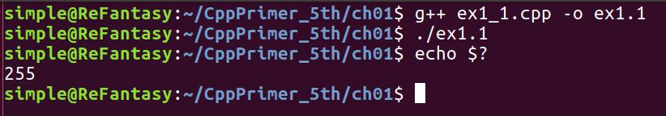
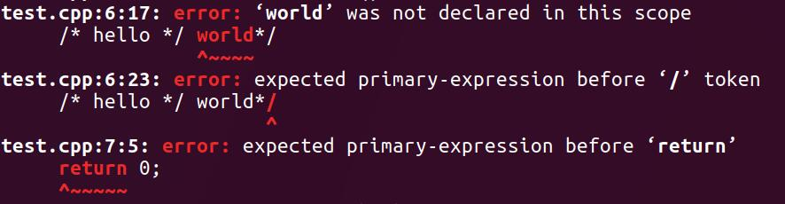

# Chapter 1
**以下是第一章的习题解答**

*EX为题号，灰色阴影部分为答案，其余为题目或其它说明*

## Ex1.1
```
//main返回0，正常结束
int main(int argc, char** argv)
{
    return 0;  
}
```

## Ex1.2
```
//main返回-1，ubuntu17.04 下 查看返回结果为255
//可见 ubuntu下系统接受的主函数的返回值类型是非负整型
int main((int argc, char** argv)
{
    return -1;  //main返回-1
}
``` 
 

## [Ex1.3](./ex1_3.cpp)

## [Ex1.4](./ex1_4.cpp)

## [Ex1.5](./ex1_5.cpp)

## Ex1.6
解释下面程序片段是否合法
```
std::cout << "The sum of" << v1;
          << " and " << v2;
          << " is " << v1 + v2 <<std::endl;
```
**答**：不合法。原因：C++中每个分号代表一条语句的结束。这段代码有三条语句，而第二条语句和第三条语句的输出运算符 << 的左侧没有运算对象。

**修改的方案如下**：

方案一：
```
std::cout << "The sum of" << v1  //去掉v1后面的分号
          << " and " << v2       //去掉v2后面的分号
          << " is " << v1 + v2 <<std::endl;
```

方案二：
```
std::cout << "The sum of" << v1;
std::cout << " and " << v2;   //加上运算对象std::cout，使之成为一条单独完整的语句
std::cout << " is " << v1 + v2 <<std::endl;  //同上
```

## Ex1.7
```
/*
*  源文件 test.cpp
*/
#include <iostream>
int main(int argc, char** argv)
{
    /*Hello*/World*/
    return 0;
}
```

**编译输出**

 

## Ex1.8
```
std::cout << "/*" ;  //正确

std::cout << "*/" ;  //正确

std::cout << /* "*/" */ ; //错误
	
std::cout << /* "*/" /* "/*" */ ; //正确
```

## [Ex1.9](./ex1_9.cpp)

## [Ex1.10](./ex1_10.cpp)

## [Ex1.11](./ex1_11.cpp)
编写程序，提示用户输入两个整数，打印出这两个整数所指定的范围内的所有的整数（只使用while）

## Ex1.12
```
求-100到100的和，sum的终值为0.
```

## Ex1.13

利用for循环 重构练习1.9到1.11的练习题

```
//重构1.9
    int sum = 0;
    for(int val = 50; val<=100; val++)
    {
        sum += val;
    }

//重构1.10
    for(int val=10; val>=0; val--)
        std::cout << val << std::endl;
    
//重构1.11
    int first, second;
    std::cout << "Enter two numbers: ";
    std::cin >> first >> second;
    for(;first==second;)
    {
        std::cout<<first<<" ";
        return 0;
    }
    for(int tmp_first = first, tmp_second = second; tmp_first<tmp_second; tmp_first++)
    {
        std::cout<<tmp_first<<" ";
    }

    for(;second>first;)
    {
        std::cout<<second<<" ";
        return 0;
    }

    for(int tmp_first = first, tmp_second = second; tmp_first>=tmp_second; tmp_second++)
    {
        std::cout<<tmp_second<<" ";
    }
```

## Ex1.14
```
当循环前明确知道循环结束条件的时候，可以使用for循环语句。
当循环的结束条件是随着循环的进行而不断改变的时候，可以考虑while循环。
具体问题具体分析，开心就好~~
```

## Ex1.15
*略*

