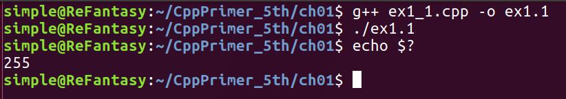

# Chapter 1
以下是第一章的习题解答
## Ex1.1

```
//main返回0，正常结束
int main((int argc, char** argv)
{
    return 0;  
}
```
## Ex1.2
```
//main返回-1，ubuntu17.04 下 查看返回结果为255
//可见 ubuntu下系统接受的主函数的返回值类型是非负整型
int main((int argc, char** argv)
{
    return -1;  //main返回-1
}
``` 
 
