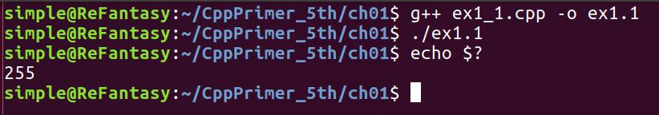

# Chapter 1
---
### Ex1.1
```
//main返回0，正常结束
int main()
{
    return 0;  
}
```

```
//main返回-1，ubuntu17.04 下 查看返回结果为255
//可见 ubuntu下系统接受的主函数的返回值类型是非负整型
int main()
{
    return -1;  //main返回-1
}
```


